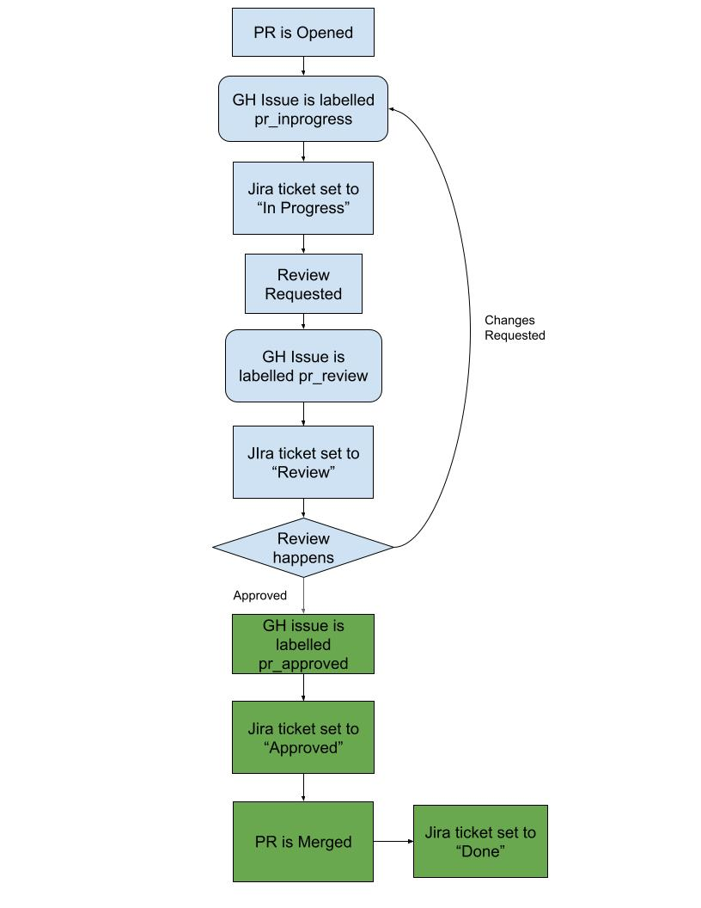

# Zathras CI/CD Infrastructure

This directory contains CI/CD infrastructure for Zathras, including:
1. **PR Management Workflows** - JIRA integration and review requirements
2. **Test Workflows** - Automated testing across clouds and bare metal

---

## PR Management Workflows

### Verify group review
This workflow requires PRs to have an additional label before they can be merged into the main branch.  Currently the label is `group_review_lgtm`, which is intended to be issued once the PR has been through a group review.

This can be done via the GitHub CLI by using the command
`gh pr edit <PR NUMBER> --add-label group_review_lgtm`.

### Verify PR has JIRA ticket and issue number
This workflow is designed to enforce requirements for PR descriptions.  At bare minimum it requires the PR to mention a related issue and mention the Jira Ticket number.  Both of these are required since Sync2Jira does not know how to associate a PR with a Jira Ticket from the originating GitHub issue.

### Update parent issue
The idea behind this workflow is to keep Jira tickets in sync with the current status of their GitHub issue.  A flowchart for how this works can be seen below.

This workflow does not work with forked repositories, since the `GITHUB_TOKEN` provided by GitHub runner will not have write access to the base repository unless the pull request originated from the base repository.

---

## Test Workflows

**NEW:** Automated testing workflows for validating Zathras across multiple environments.

### Available Test Workflows

Located in `.github/workflows/`:

- **test-aws.yml** - AWS cloud testing workflow
- **test-azure.yml** - Azure cloud testing workflow
- **test-gcp.yml** - GCP cloud testing workflow
- **test-baremetal.yml** - Bare metal testing workflow

### Features

✅ **Multi-cloud support** - AWS, Azure, GCP, and bare metal
✅ **OIDC authentication** - Secure, keyless authentication
✅ **Automated PR testing** - Runs on PRs that modify relevant code
✅ **Manual workflows** - Can be triggered on-demand
✅ **Cost optimized** - Uses spot instances, minimal resources
✅ **Automatic cleanup** - Terminates cloud resources after tests
✅ **Result artifacts** - Uploads test results for analysis
✅ **PR comments** - Posts test results to pull requests

### Quick Start

See **[CI_SETUP.md](CI_SETUP.md)** for complete setup instructions.

**Required steps:**
1. Configure OIDC authentication for each cloud provider
2. Add GitHub secrets (API keys, SSH keys)
3. Test workflows manually
4. (Optional) Set up self-hosted runner for bare metal

### Test Scenarios

Test scenarios are located in `test_scenarios/`:
- `aws_ci_test.yml` - AWS configuration
- `azure_ci_test.yml` - Azure configuration
- `gcp_ci_test.yml` - GCP configuration
- `baremetal_ci_test.yml` - Bare metal configuration

Each scenario runs a standard test suite: **linpack**, **streams**, and **fio** benchmarks.

**Total runtime:** ~15-20 minutes per cloud

### Documentation

- **[CI_SETUP.md](CI_SETUP.md)** - Complete setup guide with OIDC configuration
- **[test_scenarios/README.md](test_scenarios/README.md)** - Test scenario documentation

---

## CI Helper Container

The container image built in [issue-tagging-container] is meant to provide CI helper scripts to other repositories that
reuse the workflows in this repository.  All scripts are kept in the `/opt/tools` directory within the container.

### get_parent_issue.sh
This script fetches any parent issues mentioned in a PR.  It will output a space separated list of issue numbers.

**Usage:**
`./get_parent_issue.sh <repository path (ie redhat-performance/zathras)> <pr number>`

### determine_status.py
This script will determine the target status of a PR by
looking at the review state.  If any reviews request
changes, it will return "in progress", then if any
reviews are pending, it will return "review", if all
reviews approve the PR, it will return "approved".

**Usage:**
`python3 determine_status.py <json file of PR review states>`

OR

`gh pr view <PR Number> --json reviewRequests,latestReviews | python3 determine_status.py`

---

## Support

- **Documentation**: See [CI_SETUP.md](CI_SETUP.md) for test workflow setup
- **Issues**: Open a GitHub issue
- **Questions**: Contact the Zathras maintainers
