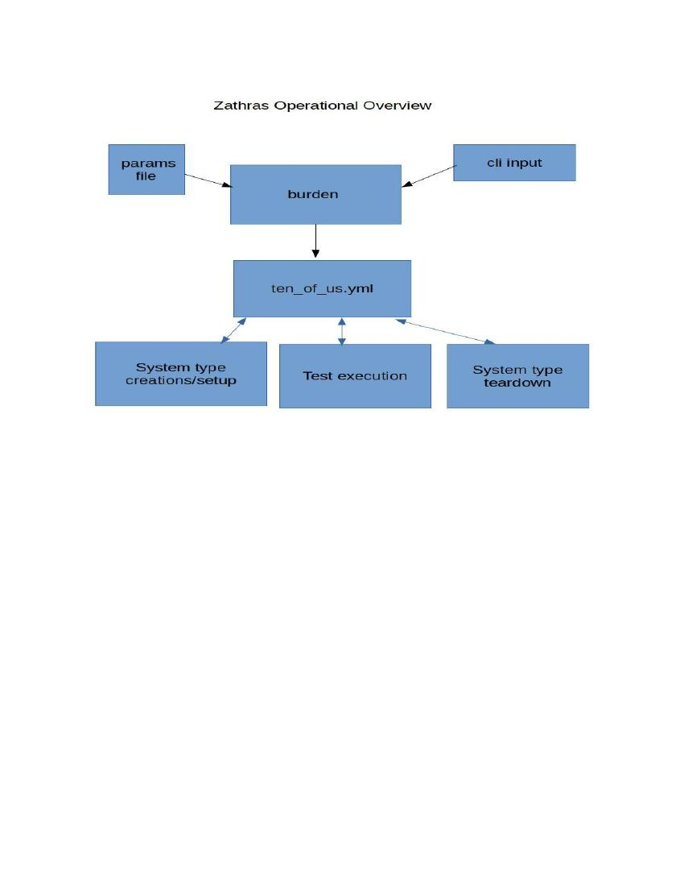

= Zathras User Guide
Author: David Valin
Version 0.9, 04/21/2022
:toc:
:toclevels: 4
:description: Zathras User Guide
:keywords: AsciiDoc
:appendix-caption: Appendix 

:sectnums:
:sectnumlevels: 5
:numbered:

// Back ground information start
== Background
=== Origin of name
The name Zathras is from a character in the TV series Babylon 5 written by J. Michael Straczynski. In
the series, Zathras says “Zathras is used to being a beast of burden to other people's needs.” Given the
main purpose of this tool is to provision a large number of systems, and then coordinate the execution
of tests across those systems, it seemed an appropriate name.

=== Born out of necessity
As part of performance analysis work, running and gathering instrumentation data is the foundation.
The process of provisioning and running tests manually is fine if you are working with a limited
number of systems and workloads. However, when either one of those axises grows, it becomes
cumbersome to deal with, much less to be able to get repeatable data. In our initial work we were
looking at running five workloads each across five machine types. That presented a total of 25 tests
to run, and 5 different cloud systems to provision every time we wanted to run the series of tests.
Another item we had to consider was that we were paying for the cloud instance on an hourly rate, so
we needed to have the instance shut down once the tests had completed, which could be at 2:00 in the
morning. At the end of this work the system count had grown to over 17 cloud systems, making it even
more critical.

=== Overall design goals
. System type support is provided via “plug-able” ansible modules. Very little knowledge of the
system type will reside outside of the module, and when present, there needs to be a strong
technical reason for it.
. To keep system types contained, there will be no shared code between system type modules. A
system-type-specific module may call a generic module, but that module will have no
knowledge specific to a system type.
. Tests are provided via plugins and Zathras will have no knowledge of any test. The test is
defined in a configuration file that is used by Zathras.
. Each test is its own standalone entity. The wrapper around the test does not have to run via
Zathras.
. Ability to change the parameters to the test without changing any bash or ansible scripts.
. There is no limit on the system types that can be supported. All Zathras requires to run a test is
a valid ip address that it can ssh to.
. System configuration modules have to support the addition of devices, networks and the
creation of the network clients. Note: the only exception is for local systems; that information
is provided by the user via a config file
. Cloud provider modules must provide a tear down operation. At the end of the test(s), Zathras
will call the appropriate tear down operation. This operation provides the minimum features:
.. Shut down the instance.
.. Destroy the cloud instance.
.. Destroy any storage allocated.
.. Remove any networks created (includes any subnets, vlans, VPCs, etc. created).
.. Any network clients that were created are removed and appropriate clean up is done.
. Support running multiple systems at the same time. Systems do not have to be of the same
type.

=== Clouds currently supported (provisions and tears the system down)
. AWS cloud
. Azure cloud
. GCP cloud

=== Local system supported
. Any system that can be ssh'd into without a passwd

=== Future support
. KVMs
. IBM Cloud

=== Zathras is not
. A test in itself. It simply launches the test.
. A data repository. Zathras will retrieve the test results if told to do so. It is the test wrapper’s responsibility for any data archiving.
. A data reduction tool. Any data reduction is handled by the wrapper, or secondary set of tools.
// Back ground information end

// Start of Setting up Zathras
== Setting up Zathras

=== Installing Zathras
Zathras resides in a RH-internal gitlab repository (change this when moved to github). To install it on your system, issue the following
command:

$ git clone https:// gitlab.zathras.com/dvalin/zathras <directory>

=== Required Packages
[cols="1,1"]
|===
|ansible
|$ dnf install -y ansible
|python
|$ yum install python3
|pip
|$ dnf install -y python3-pip
|jq
|$ dnf install -y jq
|yq
|$ pip3 install -U yq
|boto (if using AWS)
|$ pip3 install -U boto3
|awscli (if using AWS)
|$ sudo dnf install -y awscli
|azcli (if using Azure)
|See https://docs.microsoft.com/en-us/cli/azure/install-azure-cli-linux?pivots=yum
|Azure Ansible modules
|$ ansible-galaxy collection install azure.azcollection +
$ pip3 install -r ~/.ansible/collections/ansible_collections/azure/azcollection/requirements-
azure.txt
|=== 

=== Configuring Zathras
The only configuration Zathras requires is the ability to ssh to the system without a password. In the
case of the cloud environments this happens by default (including su to root without a password). In
the case of bare metal systems, if the test system is not set up for you to log in as root without a
password, you will need to add the appropriate ssh key to the test system. Use ssh-copy-id or a
similar method to copy the proper config file to the test system.

== Zathras Operational Overview
The only command the user uses is burden . The options to zathras are provided by the CLI or via a
test scenario file.

== Running Zathras
=== Zathras CLI options
++++

<pre><code>
$ ./burden --verbose
Usage: ./bin/burden
Version: 3.0
General options
  --archive &lt;dir&gt;/&lt;results&gt;: location to save the archive information to
  --child: tells burden it is a child of another burden process and not to
    perform the initial setup work
  --create_attempts: number of times we attempt to create an instance to get the
    desginated cpu type
  --git_timeout: Number of seconds to timeout on git requests.  Default is 60
  --system_type &lt;vendor&gt; aws, azure, gcp or local
  --host_config &lt;config options&gt; Specification of the system and configuration
    If the --system_type option is local, then this is simply the system name
    to run on, and it will pull the config value from the file &lt;hostname&gt;.conf
    in local_configs
      local_configs format:
        server_ips:  &lt;xx.xx.xx.xx&gt;,&lt;xx.xx.xx.xx&gt;
        client_ips: &lt;xx.xx.xx.xx&gt;,&lt;xx.xx.xx.xx&gt;
        storage: /dev/nvme2n1,/dev/nvme1n1

    If the --system_type option is a cloud type, then the following may
    be specified
      config_file format:
        Fields definition:
          instance_type: The cloud instance (ie i3en.xlarge).
            [region=&lt;value&gt;&amp;zone=&lt;value&gt;] is totally optional
            region: the region the cloud is created in, defaults to
               whatever the user's default region is
            zone: The zone in the region the cloud is to be created in, if not specified
                  will randomly pick one
          number_networks: number of internal networks to create.  If designated a second system of
		  the same configuration is created to connect the network to.,
          sysctl_settings: files in sysctl_setting to use.  Each file
                  sets a set of tunables, separator is +
          number_of_disks: How many disks to create and attach
          disk_size: How large is the disk in gigabytes
          disk_type: Type of disk to be created

      &lt;instance&gt;:&ltCloud_Placement&gt;&lt;CPU_type&gt;&amp;&lt;Disks&gt;&amp;&lt;Networks&gt;&amp;&lt;Sysctl_settings&gt;
        Fields definition:
          &lt;instance[region=&lt;val&gt;&amp;zone=&lt;val&gt;]: The cloud instance name (ie i3en.xlarge).
            includes region and zone requests, both are optional.
          &lt;Cloud_Placement=value&gt;
            value is specific to each cloud, depending on their definition.  For the placement
            name see the documenation for the cloud being designated. Default value is none
          &lt;CPU_type=value&gt;
            value is a string that is provided by the user that has to match a substring in the output
            from lscpu field, Model name:
          &lt;Disks;number=n;size=n;type=n&gt;
             number: How many disks to create and attach
             size: How large is the disk in gigabytes
             type: Type of disk creating
          &lt;Networks;number=n;type=default/public/cloud specific&gt;
             number_networks: number of internal networks to create.  Each network will
 	     create another system to connect to.
             type: default, uses the default cloud network type
                   public, uses the public dns connections
                   cloud specific, specific to each cloud
          &lt;Sysctl_settings=n+n...&gt;
            sysctl_settings: files in sysctl_setting to use.  Each file
            sets a set of tunables, separator is +
       System config file Examples
         Example 1: Designate 2 systems, no config options
           m5.xlarge,m5.4xlarge
         Example 2: Designate m5.24xlarge, 8 gp2 disks of 1200 Gig
           m5.24xlarge:Disks;number=8;size=1200;type=gp2
         Example 3: Designate m5.24xlarge with 4 networks
           m5.24xlarge:Networks;number=4
         Example 4: Designate m5.24xlarge with sys tunings udp_fix and none
           m5.24xlarge:Sysctl_settings=none+udp_fix
         Example 5: Designate m5.xlarge to be created in us-east-1 and zone b
           "m5.xlarge[region=us-east-1&amp;zone=b]"
  --ignore_repo_errors: If present we will ignore repo errors, default is to abort the run
    when a repo error occurs.
  --individ_vars: Contains various burden settings.  Takes precedence over the scenario file, but is overridden
    by the command line.  Default is config/zathras_specific_vals_def
  --java_version: java version to install, java-8, java-11
  --kit_upload_directory: Full path to directory uploading to.  If not present, Zathras will locate
      the filesystem with the most space on it and use that location.
  --max_systems &lt;n&gt;: Maximum number of burden subinstances that will be created from the parent.  Each subinstance
    is a cloud or local system. 3 is the default"
  --no_clean_up: Do not cleanup at the end of the test
  --no_packages: Do not install any packages, default is no
  --no_pbench_install: Do not install pbench.  The default is 0 (install pbench).
  --no_spot_recover: Do not recover from a spot system going away.
  --package_name &lt;name&gt;: Use this set of packages to override the default in the test config
    file instead of the default. Default format  package name &lt;os&gt;_pkg, new name &lt;os&gt;_pkg_&lt;ver&gt;.
  --persistent_log: enable persistent logging
  --preflight_check: Performs various checks on the scenario file, and Zathras and then exits
  --results_prefix &lt;prefix&gt;: Run directory prefix
  --retry_failed_tests &lt;0/1&gt;: Indicates to retry any detected failed tests if set to 1 (1 is the default).
  --scenario &lt;scenario definition file&gt;: Reads in a scenario and then runs it
    (if used, host configs are designated in the file).  If the scenario name starts with https: or git:
    then we are retrieving the scenario from a git repo. If the line in the scenario file starts with #
    , then that line is a comment.  If the line starts with a %, it indicates to replace the string.
    Format to replace a string  % &lt;current string&gt;=&lt;new string&gt;
  --scenario_vars &lt;file&gt;: file that contains the variables for the scenario file, default is config/zathras_scenario_vars_def
  --selinux_level: ennforcing/permissive/disabled.  The setting to have in /etc/selinux/config file.  Note: Ubuntu we do not support
    enforcing at this time.
  --selinux_state: disabled/enabled.  If disabled is selected, selinux will be disabled via grubby (Amazon and RHEL). For Ubuntu,
    enabled will install the require packages, update the config file and reboot.
  --ssh_key_file: Designates the ssh key file we are to use.
  --show_os_versions: given the cloud type, and OS vendor, show the available os versions
  --show_tests:  list the available test as defined in config/test_defs.yml
  --test_def_file &lt;file&gt;: test definition file to use.
  --test_def_dir &lt;dir&gt;: test definition directory.  Default is &lt;execution dir&gt;/config.  If
     https: or git: is at the start of the location, then we will pull from a git repo.
  --test_override &lt;options&gt;:  Overrides the given options for a specific test in the scenario file
    Example:
      global:
        ssh_key_file: /home/test_user/permissions/aws_region_2_ssh_key
        terminate_cloud: 1
        cloud_os_id: aminumber
        os_vendor: rhel
        results_prefix: linpack
        system_type: aws
      systems:
        system1:
          java_version: java-8
          tests: linpack
          system_type: aws
          host_config: "m5.xlarge"
        system2:
          java_version: java-8
          tests: linpack
          system_type: aws
          host_config: "m5.4xlarge"
    To override java_version for system1:
       --test_override "system1:java_version=java-11"
  --tests &lt;test&gt;: testname, you may use "test1,test2" to execute test1 and test2.
  --test_iter &lt;iterations&gt;: how many iterations of the test to run (includes linpack).
     For cloud instances, this will terminate the cloud image and start
     a new one for each iteration
  --test_versions &lt;test&gt;,&lt;test&gt;....: Shows the versions of the test the are available
    and brief description of the version.  This only applies to git repos
  --test_version_check: Checks to see if we are running the latest versions of the tests and
    exits out when done. Default is no
  --tf_list: list active systems created via tf
  --tf_terminate_list <list>: Delete the designated terraform systems.
  --tf_terminate_all: Go into each terraform directory and attempt to remove the terraform instance
  --tuned_profiles &lt;comma separated list of tuned profiles&gt;, only for RHEL. Designates the tuned
    profiles to use.  if the system type is a cloud environment, then each tuned profile is a
    distinct cloud instance.
  --tuned_reboot &lt;<val>&gt;, only for RHEL. If value is 1 we will reboot the system each time
    a new tuned profile is set.
  --verbose: Verbose usage message
  --upload_rpms <rpm 1>,<rpm 2>....: Comma separated list of rpms (full path) to upload and install
  --update_target: Image to update
    Note:  only 1 update image can be used, makes no difference
           if designate a different one for each system in the
           scenario file, the first one will be used
  ----use_latest_version: Will update the templates so we are using the latest versions of the test (git repos only)
  -h --usage: condensed usage information
Cloud options only
  --cloud_os_id &lt;os id&gt;: Image of the OS to install (example aws aminumber)
    For multiple architectures, this is allowed"
    x86:ami-0fbec8a0a2beb6a71,arm64:ami-0cfa90ca3ebfc506e"
    Burden will select the right ami for the designated host."
  --create_only: Only do the VM creation and OS install action.
  --os_vendor &lt;os vendor&gt;: currently rhel, ubuntu, amazon
  --terminate_cloud: If 1, terminate the cloud instance, if 0 leave the cloud image running.
      Default is to terminate
  --use_spot: uses spot pricing based on the contents of config/spot_price.cfg.  Default is not
      to use spot_pricing
</code></pre>

++++
=== Example usage
Viewing available tests:
----
$ ./burden --show_tests
Available tests
 aim7:  Aim 7 workloads
 auto_hpl:  High Performance LINPACK.
 burst_io:  burst_io
 coremark:  coremark test
 coremark_pro:  core mark pro test
 etcd_fio:  etcd simulation via fio, using pbench-fio
 fio:  straight fio
 hammerdb_mariadb:  hammerdb mariadb
 hammerdb_mssql:  hammerdb mssql
 hammerdb_postgres:  hammerdb postgres
 iozone:  iozone
 linpack:  standard linpack test.
 passmark:  passmark test
 phoronix:  phoronix ng test
 pyperf:  pyperfotmance test
 speccpu2017:  speccpu2017
 specjbb:  Standard specjbb test
 uperf:  uperf
----
Note, the above list is an example listing. Depending on the test definition file you are using, there
may be more or fewer tests than listed above. + 
 +
Show what versions of LINPACK are available:
----
$ ./burden --test_versions uperf
============================
uperf
============================
v1.0            Merge pull request #1 from redhat-performance/fix_output
v1.1            Merge pull request #3 from redhat-performance/fix_usage
----
List the available OSs for AWS:
----
$ burden --os_vendor rhel --show_os_versions --system_type aws
Pulling requested AWS OS image information, may take a bit.
|  2022-02-22T18:44:59.000Z|  RHEL-7.9_HVM-20220222-x86_64-0-Hourly2-GP2                 |  ami-0c1c3220d0b1716d2  |
|  2022-02-28T21:18:12.000Z|  RHEL7-STIG-MAR2022-529a0bcd-3ca5-49b1-8dde-caeb1c5fd916    |  ami-001efb8d10971ad22  |
|  2022-03-23T19:11:39.000Z|  RHEL-8.6.0_HVM_BETA-20220302-x86_64-5-Hourly2-GP2          |  ami-05e27d069dbc4f580  |
|  2022-03-23T20:18:46.000Z|  RHEL-8.6.0_HVM_BETA-20220302-arm64-5-Hourly2-GP2           |  ami-06f69f8f260e948ac  |
|  2022-03-31T13:39:59.000Z|  RHEL7-STIG-APR2022-529a0bcd-3ca5-49b1-8dde-caeb1c5fd916    |  ami-0789d5d23abced247  |
|  2022-04-03T10:32:36.000Z|  RHEL-with-GUI-04-2022-b6d61a70-2e10-45af-9b8d-fc2f45e31a9b |  ami-007edf3a9deb23516  |

----
Run streams on an AWS m5.xlarge instance. Note this assumes the streams test is configured in the config directory.
----
$ ./burden --ssh_key_file /home/test_user/permissions/aws_region_2_ssh_key --terminate_cloud 1 \
--cloud_os_id ami-0fdea47967124a409 --os_vendor rhel --results_prefix just_a_test \
--system_type aws --tests linpack --host_config "m5.xlarge"
----
Run fio on AWS i3en.xlarge instance.  Note this assumes the fio test is defined in the config directory.
----
$ ./burden --ssh_key_file /home/test_user/permissions/aws_region_2_ssh_key --terminate_cloud 1 \
--cloud_os_id ami-0fdea47967124a409 --os_vendor rhel --results_prefix just_a_test \
--system_type aws --tests fio --host_config "i3en.xlarge:Disks;type=internal"
----
Run uperf on AWS m5.xlarge. Note this assumes the uperf test is configured in the config directory.
----
$ ./burden --ssh_key_file /home/test_user/permissions/aws_region_2_ssh_key --terminate_cloud 1 \
--cloud_os_id ami-0fdea47967124a409 --os_vendor rhel --results_prefix just_a_test --system_type aws \
--tests uperf --host_config "m5.xlarge:networks;number=1"
----
Run uperf and fio on AWS m5.xlarge.  Note this assumes both fio and uperf test are configured in the config directory.
----
$ ./burden --ssh_key_file /home/test_user/permissions/aws_region_2_ssh_key --terminate_cloud 1 \
--cloud_os_id ami-0fdea47967124a409 --os_vendor rhel --results_prefix just_a_test \
--system_type aws --tests uperf,fio \
--host_config "m5.xlarge:networks;number=1&Disks;number=2;size=6000;type=gp2”
----
Run from a test scenario file:
----
$ ./burden --scenario test_to_run
----
Run from a test scenario file with using a scenario vars file
----
$ ./burden --scenario rhel_85_2 --system_type aws --scenario_vars aws_vars
----
=== Test scenario files
Defining the tests to run via a test scenario file has numerous advantages over the CLI, these
advantages include:

. Greater flexibility in defining tests.
. Ability to make complex test runs.
. Once created, can easily be exported for future use.
. Easier to modify a test.

==== Format of scenario file
----
global:
  <global options>
systems:
  system1:
    <options for system1>
  system2:
    <options for system 2>
----
There is a special host name for host_config called SYS_BARRIER . When SYS_BARRIER is seen, no new tests will be
started until all the outstanding tests are completed. + 
 +
The options in the parameters file maps directly back to the CLI options, minus the dash.
 +
Example of running streams on the local bare metal system test_sys:
----
global:
  results_prefix: just_a_test
  system_type: local
systems:
  system1:
    tests: streams
    host_config: "test_sys"
----
Run streams on AWS m5.xlarge, m5.12xlarge:
----
global:
  ssh_key_file: /home/test_user/permissions/aws_region_2_ssh_key
  terminate_cloud: 1
  cloud_os_id: ami-0fdea47967124a409
  os_vendor: rhel
  results_prefix: just_a_test
  system_type: aws
systems:
  system1:
    tests: linpack
    host_config: "m5.xlarge,m5.12xlarge"
----
Run fio on AWS m5.xlarge (2 disks) and m5.12xlarge (4 disks); disks are 6TB, and type is gp2:
----
global:
  ssh_key_file: /home/test_user/permissions/aws_region_2_ssh_key
  terminate_cloud: 1
  cloud_os_id: ami-0fdea47967124a409
  os_vendor: rhel
  results_prefix: just_a_test
  system_type: aws
systems:
  system1:
  tests: fio
    host_config: "m5.xlarge:Disks;number=2;size=6000;type=gp2,m12.xlarge:Disks;number=4;size=6000;type=gp2
----
Run fio on AWS m5.xlarge with 2 disks, and then run uperf on AWS m5.xlarge, 1
network. Note the SYS_BARRIER that indicates we will pause at that point, wait for all tests to
finish, and then start the next batch. The m5.xlarge created for fio will be terminated at the
end of the fio run and a new m5.xlarge for the uperf run will be created:
----
global:
  ssh_key_file: /home/test_user/permissions/aws_region_2_ssh_key
  terminate_cloud: 1
  cloud_os_id: ami-0fdea47967124a409
  os_vendor: rhel
  results_prefix: just_a_test
  system_type: aws
systems:
  system1:
    tests: fio
    host_config: "m5.xlarge:Disks;number=2;size=6000;type=gp2"
  system2:
    host_config: "SYS_BARRIER"
  system3:
    tests: uperf
    host_config: "m5.xlarge:Networks;number=1"
----
Just create an AWS system, then list the system information and then delete it.
----
Scenario file m6a.xlarge_sys

global:
  ssh_key_file: replace_your_ssh_key
  terminate_cloud: 0
  os_vendor: rhel
  results_prefix: create_only
  os_vendor: rhel
  system_type: aws

systems:
  system1:
    cloud_os_id: ami-078cbc4c2d057c244
    host_config: "m6a.xlarge"

# ./burden --scenario m6a.xlarge_sys --create_only
# ./burden --tf_list
work_dir: m6a.xlarge_15
	full_path: ./create_only/rhel/aws/m6a.xlarge_15/tf
	vm_size: m6a.xlarge
	instance_state: running
	public_dns: ec2-18-118-185-212.us-east-2.compute.amazonaws.com
	name_tag: dvalin_create-only-rhel-m6a.xlarge
# ./burden --tf_terminate_all
----

== Configuration File formats
=== Java configuration
Path: <zathras_directory>/config/java_pkg_def.yml +
Contents
----
---
java_defs:
  java_config1:
    java_version: java-11
      amazon: java-11-openjdk
      rhel: java-11-openjdk-devel
      ubuntu: openjdk-11-jdk
  java_config2:
    java_version: java-8
      amazon: java-1.8.0-openjdk
      rhel: java-1.8.0-openjdk-devel
      ubuntu: openjdk-8-jdk
----
In the above configuration, we have 2 known java versions, java-11 and java-8. The packages to install
are based on the version of linux we are using.
If we are running RHEL and want java-11, we will install the package java-11-openjdk-devel.
If a new version of java is available, say java-12, then the following addition to the config file will be
made (this is only an example):
----
  java_config3:
    java_version: java-12
      amazon: <amazon java 12 package>
      rhel: <rhel java 12 package>
      ubuntu: <ubuntu java 12 package>
----
=== Test configuration file
The test configuration file is used to help define a given test, and options to use.
Path: <zathras_directory>/config/test_defs.yml> +
Contents:
++++

<pre><code>
test_defs:
  test<n>:
  test_template: <path>
  test_name: <name>
  test_description: <description>
  repository_type: <repo type>
  location: <path>
  reboot_system: "yes/no"
  test_run_from: "local/remote
  repo_file: <list of packages>
  version: <version indicator>
  test_grouping: <group name>
  os_supported: <all/ubuntu/rhel/amazon>
  rhel_pkgs: <rhel packages required>
  ubuntu_pkgs: <ubuntu packages required>
  amazon_pkgs: <amazon packages required>
  pbench_required: <yes/no>
  pbench_local_results: <yes/no>
  storage_required: <yes/no>
  network_required: <yes/no>
  java_required: <yes/no>
  archive_results: <yes/no>
  test_script_to_run: <test script>
  test_specific: <extra test options>
  upload_extra: <comma separated list of files to upload, none if there is no file>
</code></pre>

++++

Field definitions: +
*test<n>:* is a unique numerical value from the other tests. Other than for creation of the yml file, it
has no bearing on the test execution. +
*test_template:* Is a pointer to a specific test template that will be brought in.  Purpose is that when we need to make changes for a specifc test, we update the test_template file not the test_defs.yml. +
*test_name:* designates the name that zathras knows the test by. This name is what is passed in with
the --tests option. +
*test_description:* A brief description of what the test does. This information is displayed when the
--show_tests option is provided to burden. +
*repository_type:* The type of repository that the test is located in. Current valid values are +

. git_tar: Mainly used when pulling an entire git repository for a test. +
.  git_file: Designated when we are pulling a single file from a git repository
. git_tag: Will pull based on the git_tag.
. file: Indicates we are copying a file.
. tar: Indicates we are copying a tarball.

*location:* Is the location at which the test can be found. Note in the case of git, it will be everything
minus the actual location name. For example, if we have:
----
https://github.com/redhat-performance/streams-wrapper/

We will drop the streams-wrapper on the end and have

https://github.com/redhat-performance/
----
*version:* The version of the test to use. For a listing of versions available, you can issue the following command:
----
$ ./burden --test_versions streams
============================
streams
============================
v1.0            Merge pull request #2 from redhat-performance/fix_usage
----
*test_grouping :* Is the grouping name of the tests. In the case of a git repo, it will be the actual
location name. For example, if we have:
----
https://github.com/redhat-performance/streams-wrapper/
----
we drop everything but streams-wrapper and use "streams-wrapper" +
*os_supported:* What Operating Systems are supported. rhel, ubuntu, amazon or all. +
*reboot_system:* This is for cloud systems, and will reboot the cloud system once it has been created. +
*test_run_from:* Some tests need to run from the local system, not the cloud system (boot timing test
is one example). If local is specified, the test will run locally, if remote is specified the test will run on
the test system. +
*repo_file:* The archive file to be downloaded.  In the case of git repos, it will be <tag>.zip +
*rhel_pkgs:* RHEL packages that are required to run the test; “none” if there aren't any packaging requirements +
*ubuntu_pkgs:* Ubuntu packages that are required to run the test; “none” if there aren't any packaging requirements. +
*amazon_pkgs:* Amazon packages that are required to run the test; “none” if there aren't any packaging requirements. +
*pbench_required:* If set to yes, the test requires pbench to be installed to run. Zathras will install
pbench on the test system for you. Only supported for RHEL/Fedora. *Note:* it is the responsibility of the user to make sure the pbench repos are set up properly. +
*pbench_local_result:* If set to yes, will tell the various wrapper scripts to consolidate the pbench results into a results tarball in /tmp with the format:
----
results_<workload>_<tuned_setting>.tar
e.g.
results_pbench_linpack_tuned_virtual-guest_sys_file_none.tar
----
*storage_required:* If set to yes, Zathras will check to make sure storage has been designated for the system before provisioning it. +
*network_required:* If set to yes, Zathras will check to make sure a network (other than the defaults)
has been designated for the system before provisioning it. +
*java_required:* If set to yes, Zathras will make sure that a Java Version has been provided before provisioning any system. +
*archive_results:* Tell zathras that it has test results to retrieve from the test system. +
*test_script_to_run:* The script that Zathras is to run. +
*test_specific:* Test options that are specific to the test. +
*upload_extra:* If not set to “none”, uploads the each file in the comma separated list to the test system. +
 +
Example entry (not using test templates or default_template.yml) +
++++

<pre><code>

  test3:
    test_name: streams
    exec_dir: "streams-wrapper-1.0/streams"
    location: https://github.com/redhat-performance/streams-wrapper/archive/refs/tags
    reboot_system: "no"
    test_run_from: "remote"
    os_supported: all
    repo_file: "v1.0.zip"
    rhel_pkgs: gcc,bc
    ubuntu_pkgs: gcc,build-essential,libnuma-dev,zip,unzip
    amazon_pkgs: gcc,bc,git,unzip,zip
    pbench_required: "no"
    pbench_local_results: "no"
    storage_required: "no"
    network_required: "no"
    java_required: "no"
    archive_results: "yes"
    test_script_to_run: streams_run
    test_specific: ""
    upload_extra: "none"
    post_script: "none"
    pre_setup: "none"
</code></pre>

++++
=== default_template.yml
There is a special template file, that if present will fill in missing fields in the test_defs file.  This allows the user to consolidate items that have a general default into a file that is shared by every test template file.  If the entry appears in the test template file, it will override the entry in the default template.
Example of default_template.yml file
----
reboot_system: "no"
test_run_from: "remote"
os_supported: all
pbench_required: "no"
pbench_local_results: "no"
storage_required: "no"
network_required: "no"
java_required: "no"
archive_results: "yes"
test_specific: ""
upload_extra: "none"
post_script: "none"
pre_setup: "none"
----
Now the streams template shown in the above section will become
----
    test_name: streams
    exec_dir: "streams-wrapper-1.0/streams"
    location: https://github.com/redhat-performance/streams-wrapper/archive/refs/tags
    repo_file: "v1.0.zip"
    rhel_pkgs: gcc,bc
    ubuntu_pkgs: gcc,build-essential,libnuma-dev,zip,unzip
    amazon_pkgs: gcc,bc,git,unzip,zip
    test_script_to_run: streams_run
----
=== Test template file
This file, if it exsists, contains the specific information for the test, instead of having everything reside in the test_defs.yml file. +
----
streams_template.yml file

location: https://github.com/redhat-performance/streams-wrapper/archive/refs/tags
exec_dir: "streams-wrapper-1.0/streams"
repo_file: "v1.0.zip"
os_supported: all
rhel_pkgs: gcc,bc
ubuntu_pkgs: gcc,build-essential,libnuma-dev,zip,unzip
amazon_pkgs: gcc,bc,git,unzip,zip
test_script_to_run: streams_run
----
With the default_template.yml desingated above, the entry for the streams test_defs.yml becomes
----
 test3:
    test_template: streams_template.yml
    test_name: streams
----
Order that information is used +

. cli
. test_defs.yml
. "test_template file"
. default_template.yml

=== Sysctl configuration file
This file designates the system control values to be used by test. +
Path: <zathras_directory>/sysctl_settings/<file name> +
----
File format: </proc setting>=<value>
Example:
/proc/sys/net/core/netdev_max_backlog=10000
----
=== Local host configuration file
This file designates the network and storage to be used by a local system. +
Path: <zathras_directory>/local_configs/<hostname>.conf +
 +
Contents: (any of the following lines) +
server_ips: <host>,<host>.... +
client_ips: <host>,<host>..... +
storage: <device>,<device>.... +
Example +
----
server_ips: zathras_server_1,zathras_server_2
client_ips: zathras_client_1,zathras_client_2
----
=== config/spot_price.cfg
This file defines the spot configuration pricing for various systems. +
Contents: +
<instance name>:<start price>:<increment by>:<end price> +
Example +
----
m5.xlarge:0.10:0.02:0.19
m5.2xlarge:0.23:0.02:0.35
m5.4xlarge:0.30:0.05:0.75
m5.8xlarge:0.80:0.10:1.50
m5.12xlarge:1.00:0.25:2.25
m5.24xlarge:1.75:0.25:4.50
----
=== Scenario variable file
To allow the scenarios file to be more generic across the various cloud platforms, a scenario variable
file is used. The file contains variables that are prefixed with the the system type (aws, azure, gcp or
local) and has a string associated with it. This string will replace all entries designated as [string] in
the scenario file. +
 +
Example scenario variable file: +
++++

<pre><code>

ssh_key_file: /home/user/permissions/aws_region_2_ssh_key
os_vendor: rhel
results_prefix: full_testing
#
#
aws_system_type: aws
aws_cloud_os_id: ami-0fdea47967124a409
aws_no_storage_x86: m5.xlarge,m5.24xlarge
aws_no_storage_non_x86: m5a.xlarge,m5a.2xlarge
aws_networks: i3en.xlarge:Networks;number=1,i3en.2xlarge:Network;number=1
#
aws_hammer_storage:i3en.2xlarge:Disks;type=internal,m5.2xlarge:Disks;type=gp2;size=6000;number=2
#
aws_storage: i3en.xlarge:Disks;type=internal,m5.24xlarge:Disks;type=gp2;size=6000;number=8
#
#
azure_system_type: azure
azure_cloud_os_id: az_os_info
azure_no_storage: az_system
azure_networks: az_system:Networks;number=1

scenario file

global:
  ssh_key_file: [ssh_key_file]
  terminate_cloud: 1
  cloud_os_id: [cloud_os_id]
  os_vendor: [os_vendor]
  results_prefix: [results_prefix]
  system_type: [cloud_type]
systems:
  system1:
    tests: streams
    host_config: "[no_storage]"
  system2:
    host_config: "SYS_BARRIER"
  system3:
    tests: uperf
    host_config: "[networks]"
</code></pre>

++++
To run Zathras and have the values in the scenario file updated for an aws run, the command is +
----
$ ./burden --scenario <scenario file> --scenario_vars <scenario vars file> --system_type aws
----
To run Zathras and have the values in the scenario file updated for an azure run, the command is +
----
$ ./burden --scenario <scenario file> --scenario_vars <scenario vars file> --system_type azure
----
=== Tags configuration file
The tags configuration file, config/tags.conf, contains a set of tag names that Zathras will tag the instance
with.  Defined tags +
++++

<pre><code>

  full_name: your name
  manager: managers name
  project: project name
  env: name of the environment assoicated with
</code></pre>

++++
== Adding a test
=== Requirements for adding a test
. The test is not allowed to prompt for any user input
. The test must handle full automation of its environment. That includes any filesystem or logical
volume creation.
. The test must recognize the following passed options (it may simply ignore them but must not error if they are passed in).  If the test is using https://github.com/dvalinrh/test_tools/general_setup (recommended), then these are automatically handled.
* --home_parent: Parent directory of the user's home directory. If the home directory is /home/test_user, then the value for this will be /home.
* --host_config <value>: default is the current host name
* --iterations : how many times we are to run the test.
* --pbench: use pbench-user-benchmark and place information into pbench, defaults to do not use
* --pbench_copy: Copy the pbench data, not move it.
* --pbench_user <value>: user who started everything. Defaults to the current user.
* --run_label: the label to associate with the pbench run
* --run_user : user running the test
* --sys_type : At this time will be one of: aws, azure, gcp or local.
* --sysname : name of the system we are running. In the case of cloud instances, this will be the name of the instance; this should be included in the results name
* --tuned_setting : tuned profile to use; this should be included in the results name
* --usage: this usage message
. Test must call invoke_test in the following manner to log the command execution and create a tuned results file
*	if [ ! -f "/tmp/${test_name}.out" ]; then
*		${TOOLS_BIN}/invoke_test --test_name ${test_name} --command ${0} --options "${arguments}"
*		exit $?
*	fi
*   $test_name is the name of the test, will be tagged to the stdout file
*   ${TOOLS_BIN} is the loction of the tools_bin binary
*   ${arguments} is the saved arguments.
. Test is also responsible for indicating if the test ran sucessfuly.  A value of "Ran" or "Failed" is placed in the file test_results_report.  It is the responsiblity of the test to save this file in the proper location. +
. Test is responsible for archiving any results to be passed back. That result information is placed
in a tarball located in /tmp and has the following naming convention: 
----
    results_<test running>_tuned_<tuned_config>_file_<sys settings>.tar
----
*  Note: Failure to have the results in that format will result in Zathras not being able to find the results of the test.

=== Adding a test to Zathras
. Edit the config/test_defs.yml file and copy one of the existing tests
. Change “ test<n>: ” to a unique <n> value; normally this is just incrementing the last test but that is not strictly required.
. Change “ test_name: ” to be the name you want to call the test.
. Change “ test_description: ” field to be the description for your test.
. Update repository_type, location and test_grouping to reflect where Zathras is to get the test from
. Change “ test_script_to_run: ” to be the name of the script Zathras is to run.
. If you have specific test options to be passed in, update the “ test_specific: ” field to have hose values, otherwise it must be the empty string “”.
. Update the remainder of the fields to your needs, see section 5.2 for more details on the available fields.

=== Example of adding a test to Zathras
* Test name: sample_test
* Options: standard options
* Test location: https://github.com/redhat-performance
* Test version: 1.0 +

sample_test.sh framework
++++

<pre><code>

#!/bin/bash

arguments="$@"
chars=`echo $0 | awk -v RS='/' 'END{print NR-1}'`
run_dir=`echo $0 | cut -d'/' -f 1-${chars}`
test_name="sample_test"

usage()
{
        echo Usage ${1}:
        echo Specific test usage here
        #
        # General usage information, does not return
        #
        source test_tools/general_setup --usage
}

#
# Location to pull the test_tools used from
#
tools_git=https://github.com/dvalinrh/test_tools

#
# Clone the repo that contains the common code and tools
#
show_usage=0
found=0
for arg in "$@"; do
        if [ $found -eq 1 ]; then
                tools_git=$arg
                break;
        fi
        if [[ $arg == "--tools_git" ]]; then
                found=1
        fi

        #
        # Check to see if usage is requested, if so call usage.
        # We do this so we do not pull in the common git.
        #
        if [[ $arg == "--usage" ]]; then
                show_usage=1
        fi
done

if [ ! -d "test_tools" ]; then
        git clone $tools_git
        if [ $? -ne 0 ]; then
                echo pulling git $tools_git failed.
                exit
        fi
fi

if [ $show_usage -eq 1 ]; then
        usage $0
fi

#
# Variables set
#
# TOOLS_BIN: points to the tool directory
# to_home_root: home directory
# to_configuration: configuration information
# to_times_to_run: number of times to run the test
# to_pbench: Run the test via pbench
# to_puser: User running pbench
# to_run_label: Label for the run
# to_user: User on the test system running the test
# to_sys_type: for results info, basically aws, azure or local
# to_sysname: name of the system
# to_tuned_setting: tuned setting
#

source test_tools/general_setup "$@"
#
# Important: this follows source test_tools/general_setup so we have $TOOLS_BIN set.
#

if [ ! -f "/tmp/${test_name}.out" ]; then
        ${TOOLS_BIN}/invoke_test --test_name ${test_name} --command ${0} --options "${arguments}"
        exit $?
fi

#
# Define user options
#
ARGUMENT_LIST=(
        &lt; test specific options &gt;
)

# read arguments
opts=$(getopt \
    --longoptions "$(printf "%s:," "${ARGUMENT_LIST[@]}")" \
    --name "$(basename "$0")" \
    --options "h" \
    -- "$@"
)

#
# If there is an error, bail out.
#
if [ $? -ne 0 ]; then
        usage $0
fi

eval set --$opts

while [[ $# -gt 0 ]]; do
        case "$1" in
                &lt; test specific options&gt;
                --)
                        break
                ;;
                *)
                        echo "not found $1"
                        usage "0"
                ;;
        esac
done

#
# Execute test code here
#

#
# Determine if the test passed or not
#

#
# Record the test status
#
if [ $status == 1 ]; then
	echo Failed >> /tmp/test_results_report
else
	echo Ran >> /tmp/test_results_report
fi </code></pre>

++++
Create the following in the file config/sample_test.yml
++++

<pre><code>
location:  https://github.com/redhat-performance/sample_test-wrapper/archive/refs/tags
exec_dir: "sample_test-wrapper-1.0/sample_test"
repo_file: "v1.0.zip"
test_grouping: sample_test
os_supported: all
test_script_to_run: sample_test.sh
</code></pre>

++++
Add the following to the file config/test_defs.yml (note test16: has to be a unique name from the other test<n>
++++

<pre><code>
  test16:
    test_template: sample_test.yml
    test_name: sample_test
    test_description:  Just a sample test addition.
</code></pre>

++++
The test is now added to Zathras, and may be executed as any other test is.

== Files created from run
Zathras will create the following in the directory you are running it from.

. Results_directory: results_name/os_vendor/cloud_type/instance_type
* results_name: name is from the Zathras option --results_prefix 
* os_vendor: name is from the Zathras option --os_vendor
* cloud_type: name is from the Zathras opption --system_type
* instance_type: name is from the --host_config option, using just the first field.  There will be added to the end of the name _x where x is a numerical value
. The Results directory contains the information used to run the test as well as the results tarball.  Note we do not save any of the terraform creation information as it takes up too much space.
. failed_runs: created in the run directory if a test failed (test failed/passed is up to each test script).  Contained in the file will be 
*     timestamp system message
. ansible_log: log file of ansible output.
. results info: Created in the run directory, Contains the run information of all the tests.
* Example file
+
----
========================================
system config: m5.xlarge
  test: streams
    date: Thu Jul 21 13:05:53 EDT 2022
    location: https://github.com/redhat-performance/streams-wrapper/archive/refs/tags
    test_script_to_run: streams_run
    test_specific: ""
    results_ptr: info_test/rhel/aws/m5.xlarge_0/results_streams_tuned_none_sys_file_none.tar
----
. In run direrctory: test_system_usage: Contains the test run information for this particular run
+
++++

<pre><code>
    User                      Run label   Instance                     Date  Price         Test   Time     Cost
    dvalin             m6_comparison_rhel m5a.xlarge      2023.02.01-14.20.52 0.1720      streams     46    .0021

</code></pre>

++++
. In directory running burden from, test_system_usage: Contains all the test run information that have been done from this directory
+
++++

<pre><code>
    User                      Run label   Instance                     Date  Price         Test   Time     Cost
    dvalin             m6_comparison_rhel m5a.xlarge      2023.02.01-14.20.52 0.1720      streams     46    .0021
    dvalin               specjbb_run_rhel m5a.xlarge      2023.02.02-05.21.26 0.1720      specjbb    260    .0124

</code></pre>

++++
. In /home/zathras_log directory (if it exist), zathras_log_file: Contails the test run information performed on the systme.  Note, if the directory/file does not exist we will not write to it.  The file has to be writeable by the user.
++++

<pre><code>
    User                      Run label   Instance                     Date  Price         Test   Time     Cost
    dvalin             m6_comparison_rhel m5a.xlarge      2023.02.01-14.20.52 0.1720      streams     46    .0021
    dvalin               specjbb_run_rhel m5a.xlarge      2023.02.02-05.21.26 0.1720      specjbb    260    .0124
  sousinha               linpack_run_rhel  m5.xlarge      2023.02.02-05.21.26 0.1820      linpack     60    .0033

</code></pre>
++++
== Host definition
Hosts are defined the same regardless whether they are passed on the command line or in a test
scenario file. The only difference in the full host definition is between local and cloud systems. With
local systems, we do not designate disk/network resources on the command line, but use a config file in
the directory local_config . For cloud systems, we designate the resources and the instance type as
string. +

=== Local system definition
Any system that is up and can be logged in to with ssh via an IP address or hostname can be viewed as
a local system. +
 +
For the CLI and test scenario file we simply use the host_config option to designate the system. For
the CLI this is done via: +
----
--host_config <host name or ip addr>
----
Via the test scenario file, we have this line in the file:
----
host_config: <host name or ip addr>
----
In the directory local_configs we have a file named <host_name>.config whose content gives the
system resources to use. That file format is defined in section 5.6. The settings in this file are what the
test will use for the various resources. Note Zathras does not understand anything about existing disk
information, and it is not a requirement of the test wrappers either. This means if you designate a disk
that has data you want to keep, it may very well be destroyed.

=== Cloud Systems
As part of the host config definition, the system resources will also be designated. As with local
systems, the definition format is the same between the CLI and test definition file +
Format of definition string: +
----
<cloud_instance_name>:<resource definition>&<resource definition>
----
cloud_instance_name : the name of the cloud instance type (e.g. m5.xlarge, Standard_D8s_v3). As
part of this definition you are able to designate the Region/zone to create the instance in, so in case of +
AWS: +
----
m5.xlarge[region=us-east-1&zone=b]
----
Will create an m5.xlarge image in the us-east-1 region, zone b. +
Resource definitions have the following format: +
Disk definition:
----
Disk:number=<n>;size=<y>;type=<t>
----
Where: +
* number= designates the number of disks to create. +
* size= designates the size of the disk in gigabytes. +
* type= designates the disk type. +
 +
Note: there is a special type that is called internal. Internal means the storage is internal
to the instance (ie i3en* in AWS, Lsv2 in Azure). If that is specified, you do not need to
worry about the number of disks or their size. You still may designate disks to create
which will be used as well as any internal disks discovered. This is required for those
instance types that have node-local storage as Zathras does not attempt to keep a list to
know when it is okay to not specify additional disks for benchmarks that require storage. +
 +
Network designation: +
----
Networks:number=1
----
sysctl designation
----
sysctl_settings=<file>+<file>
----
A list of files (that live in sysctl_settings) that have values
we are to set via sysctl. Each file is a complete run of the tests. File format: +
/proc/sys/net/core/netdev_max_backlog=10000 +

== Flow overview
=== Burden logic flow
image::burden_flow.jpg[]
=== kickoff.sh logic flow
image::kickoff_flow.jpg[]
=== ten_of_us .yml logic flow
image::ten_of_us_flow.jpg[]
=== test execution logic flow
image::test_exec_flow.jpg[]

== URLs of interest
=== https://github.com/redhat-performance
Contains the publicly available test wrappers for Zathras.  The wrappers are suffixed with -wrapper.  Note, certain workloads require an upload of a binary package (linpack, spec*), those are not included because of licensing agreements.

=== https://github.com/redhat-performance/test_tools-wrappers
Contains a list of generic test tools that are used during execution of Zathras.  This is pulled in automatically via the test_wrapper and may be overridden by passing the option --tools_git <git location> to the wrapper.

:numbered!:
[appendix]
== Execution Example
Note: Need to update the URL when we GA Zathras +
First clone the zathras code
----
$ git clone https://gitlab.cee.redhat.com/dvalin/zathras zathras_exec
Cloning into 'zathras_exec'...
warning: redirecting to https://gitlab.cee.redhat.com/dvalin/zathras.git/
remote: Enumerating objects: 4576, done.
remote: Counting objects: 100% (82/82), done.
remote: Compressing objects: 100% (46/46), done.
remote: Total 4576 (delta 46), reused 60 (delta 32), pack-reused 4494
Receiving objects: 100% (4576/4576), 39.17 MiB | 16.97 MiB/s, done.
Resolving deltas: 100% (2491/2491), done.
$
-----
Now change to the zathras exec directory and clone the test config information.
----
$ cd zathras_exec
$ mv config config1
$ git clone https://github.com/redhat-performance/zathras_test_configs config
Cloning into 'config'...
remote: Enumerating objects: 29, done.
remote: Counting objects: 100% (29/29), done.
remote: Compressing objects: 100% (24/24), done.
remote: Total 29 (delta 3), reused 29 (delta 3), pack-reused 0
Unpacking objects: 100% (29/29), 7.08 KiB | 1.18 MiB/s, done.
$
----
We want to run AWS m5.xlarge (x86), RHEL 9, need to locate the proper AMI
----
$ ./burden --show_os_versions --os_vendor rhel --system_type aws | egrep "RHEL-9.*x86"
|  2021-11-02T14:55:39.000Z|  RHEL-9.0.0_HVM_BETA-20211026-x86_64-10-Hourly2-GP2 |  ami-0fbec8a0a2beb6a71  |
----
Create the file aws_example with the following content
----
global:
  ssh_key_file: <your ssh key for the aws system>
  terminate_cloud: 1
  cloud_os_id: ami-0fbec8a0a2beb6a71
  os_vendor: rhel
  results_prefix: testing
  system_type: aws
systems:
  system1:
    tests: streams
    host_config: "m5.xlarge"
----
Now execute the desired test.
----
$ ./burden --scenario aws_example
----
There will be a large amount of messages displayed on the screeen.  When the test is complete, to look at the results
----
$ cd testing/aws/rhel
$ ls
$ cd testing/rhel/aws/m5.xlarge_0
$ ls res*str*tar
results_streams_tuned_none_sys_file_none.tar
$ tar xvf results_streams_tuned_none_sys_file_none.tar
----
Look for the csv file results_streams.csv +
Other information in the directory of interest +

. streams.cmd: the command that was run to execute the test
. boot_info directory: contains boot timing information
. cloud_timings: contains the time to start and terminate the instance
. meta_data.yml: meta data information on the system.

[appendix]
== Using scenario variables file

We will use the setup from the Appendix titled "Execution Example" +
Create the file config/scenario_example, containing the following information
----
aws_os_id: ami-0fbec8a0a2beb6a71
aws_host_config: m5.xlarge
azure_os_id: RedHat:RHEL:8-LVM:8.4.2021091103
azure_host_config: Standard_D8s_v3
----
Now modify the aws_example file created earlier to look like
----
global:
  ssh_key_file: <your ssh key for the aws system>
  terminate_cloud: 1
  cloud_os_id: [os_id]
  os_vendor: rhel
  results_prefix: testing
systems:
  system1:
    tests: streams
    host_config: [host_config]
----
To run the streams test on the AWS system
----
$ ./burden --scenario aws_example --scenario_vars config/scenario_example --system_type aws
----
To run the streams test on the Azure system
----
$ ./burden --scenario aws_example --scenario_vars config/scenario_example --system_type azure
----
This is a very simple example of using the scenario vars file, it becomes much more useful when dealing with
multiple workloads, with multiple resourcce requirements (disks, networks etc).

[appendix]
== Changing test options from the cli

Create the file aws_example with the following content
----
global:
  ssh_key_file: <your ssh key for the aws system>
  terminate_cloud: 1
  cloud_os_id: ami-0fbec8a0a2beb6a71
  os_vendor: rhel
  results_prefix: testing
  system_type: aws
systems:
  system1:
    tests: streams
    host_config: "m5.xlarge"
  system2:
    host_config: "SYS_BARRIER"
  system3:
    tests: streams
    host_config: "m5.xlarge"
----
Note we are using SYS_BARRIER to force the first test to complete, before starting the next test. +
We will designate that the streams test defined in system3, will use the AWS image m5.4xlarge, instead of m5.xlarge
To do this, we issue the following command
----
$ ./burden --scenario aws_example  --test_override "system3:host_config=m5.4.xlarge"
----
Looking at the generated results directories we see
----
$ ls doc_testing/rhel/aws
m5.4xlarge_0  m5.xlarge_0
----
So we ran both m5.4xlarge and m5.xlarge, not two m5.xlarges as designated in the scenario file.

[appendix]
=== Desginating multiple hardware architectures
Executing a scenario file, with multiple hardware architectures. +
Create the file aws_example with the following content
----
global:
  ssh_key_file: <your ssh key for the aws system>
  terminate_cloud: 1
  cloud_os_id: x86:ami-0fbec8a0a2beb6a71,arm64:ami-0cfa90ca3ebfc506e
  os_vendor: rhel
  results_prefix: testing
  system_type: aws
systems:
  system1:
    tests: streams
    host_config: "m6g.xlarge,m5.xlarge"
----
Run the following command
----
$ ./burden --scenario aws_example
----
Now take a look at the results directory
----
$ ls testing/aws/rhel
m5.xlarge_0  m6g.xlarge_0
----
We see that we ran both m5.xlarge (x86) and m6g.xlarge (arm64) systems.

[appendix]
=== Checking the test versions
To check the versions of all the tests are latest, run the following command
----
$ ./burden --test_version_check
Git version check.
                            Test     Using    latest    Ok
               aim7_template.yml      v1.0      v1.0   yes
                     autohpl.yml      v1.0      v1.1    no
                    burst_io.yml      v1.1      v1.2    no
       coremark_pro_template.yml      v1.0      v1.0   yes
           coremark_template.yml      v1.0      v1.0   yes
                fio_template.yml      v1.3      v1.3   yes
           hammerdb_template.yml      v1.0      v1.0   yes
             iozone_template.yml      v1.0      v1.0   yes
            linpack_template.yml      v1.0      v1.0   yes
           passmark_template.yml      v1.0      v1.0   yes
           phoronix_template.yml      v1.2      v1.2   yes
                pig_template.yml      v1.0      v1.0   yes
      pyperformance_template.yml      v1.0      v1.0   yes
        speccpu2017_template.yml      v1.0      v1.0   yes
            specjbb_template.yml      v1.3      v1.3   yes
            streams_template.yml      v1.1      v1.1   yes
              uperf_template.yml      v1.0      v1.1    no
----
In the example of above, we see autohpl, burst_io and uperf are not runniing the latest test.

[appendix]
=== Update config file versions to the latest (github only)
To update the test configs to be the latest version (github only) run the following command
----
$ ./burden --update_test_versions
updating test versions
Updating version for autohpl.yml from v1.0 to v1.1
Updating version for burst_io.yml from v1.1 to v1.2
Updating version for uperf_template.yml from v1.0 to v1.1
----
